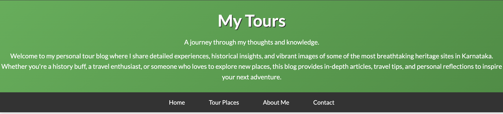
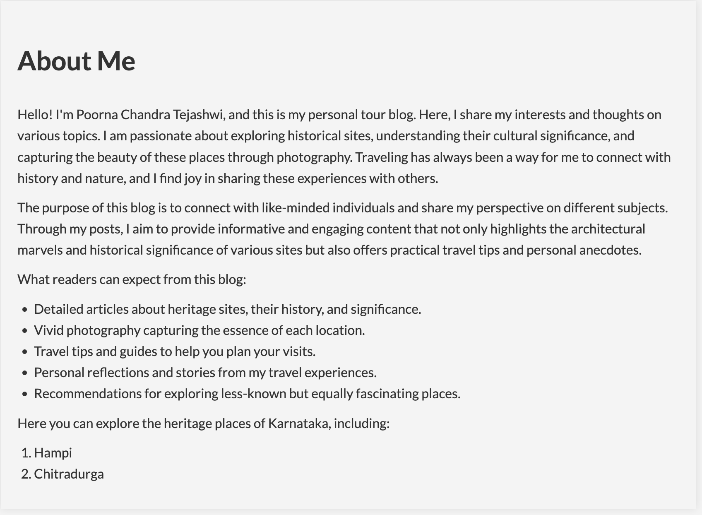
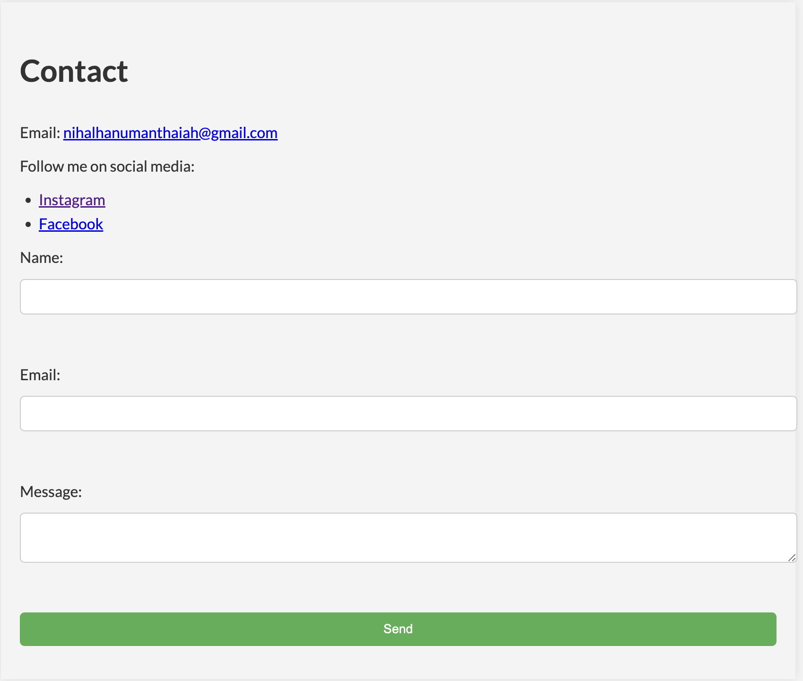

# My Tours Personal Blog

Welcome to My Tours Personal Blog! This blog showcases detailed experiences, historical insights, and vibrant images of some of the most breathtaking heritage sites in Karnataka. The blog is built using HTML and CSS, providing a modern and visually appealing design.

## Table of Contents
- [Project Overview](#project-overview)
- [Features](#features)
- [Technologies Used](#technologies-used)
- [Setup](#setup)
- [Screenshots](#screenshots)
- [Usage](#usage)
- [File Structure](#file-structure)
- [License](#license)

## Live Deployment
```sh
https://main--my-karnatakablog.netlify.app
```


## Project Overview
The My Tours Personal Blog is designed to share detailed articles, travel tips, and personal reflections on various heritage sites in Karnataka. The blog includes:
- A welcoming header section
- A navigation bar for easy access to different sections
- Blog posts section with articles and media
- About Me section
- Contact form
- Footer with additional links

## Features
- **Responsive Design**: Adapts to different screen sizes for a consistent user experience.
- **Navigation Bar**: Smooth navigation with hover effects.
- **Blog Posts**: Styled articles with images and videos.
- **About Me Section**: Information about the author with a distinct background.
- **Contact Form**: Allows users to send messages.
- **Footer**: Contains additional links and copyright information.

## Technologies Used
- **HTML5**: For structuring the content.
- **CSS3**: For styling and enhancing the visual appearance.

## Setup
To set up the project locally, follow these steps:

1. Clone the repository:
```sh
   git clone https://github.com/yourusername/my-tours-blog.git
```
2.Navigate to the project directory:

 ```sh
cd my-tours-blog
 ```

3.Open the index.html file in your web browser to view the blog.

## Screenshots

**HEADER**

 

**About Me**



**Contact**



**Footer**


## Usage

Open index.html in a web browser to view the blog.
Navigate through different sections using the navigation bar.
Read blog posts, view images, and watch videos.
Learn more about the author in the "About Me" section.
Use the contact form to send a message.

## File Structure

```sh
my-tours-blog/
├── index.html
├── styles.css
└── README.md

```

index.html: Contains the HTML structure of the blog.
styles.css: Contains the CSS styles for the blog.
README.md: This README file.

## License

This project is licensed under the MIT License. See the LICENSE file for more details.

## Authors

Poorna Chandra Tejashwi
For any inquiries or issues, feel free to contact:

Email: nihalhanumanthaiah@gmail.com
Instagram: @p.c.t.n
Facebook: Poorna Chandra Tejashwi
Enjoy exploring the My Tours Personal Blog!